# 👋 Hi, I’m @Jack251970 (Jack Ye)

## A perfectionist in a certain sense

* 🌱 I’m currently learning deep learning related to time-series forecasting, reinforcement learning, power system, LLM, etc.

* 👀 I’m interested in Windows application development, especially WPF and WinUI3.

  * Member of [Flow-Launcher](https://github.com/Flow-Launcher)
  * Owner of [ContextMenuManager](https://github.com/Jack251970/ContextMenuManager)
 
* ❤️ I enjoy writing code in my spare time to inject my ideas into open-source projects.

* 📫 How to reach me? Mail to [jack1160210343@gmail.com](mailto:jack1160210343@gmail.com).

> Life is short, You need Python.

  <picture>
    <source media="(prefers-color-scheme: dark)" srcset="./profile/stats_dark.svg">
    <source media="(prefers-color-scheme: light)" srcset="./profile/stats_light.svg">
    
  </picture>

  <picture>
    <source media="(prefers-color-scheme: dark)" srcset="./profile/trophy_dark.svg">
    <source media="(prefers-color-scheme: light)" srcset="./profile/trophy_light.svg">
    
  </picture>

## Tools using & recommended to maximize productivity

* [ContextMenuManager](https://github.com/Jack251970/ContextMenuManager): Manage right-click context menu items.
* [DIDA](https://www.dida365.com): Manage todo List and calendar.
* [EyeProtect](https://github.com/Jack251970/EyeProtect): Protect eyes based on the 20-20-20 rule.
* [Flow Launcher](https://github.com/Flow-Launcher/Flow.Launcher): Quick file search & app launcher.
* [Immersive Translate](https://immersivetranslate.com): Bilingual web page translation.
* [Inkscape](https://inkscape.org): Draw complex vector graphics.
* [Internet Download Manager](https://www.internetdownloadmanager.com): Download accelerator.
* [Obsidian](https://obsidian.md): Flexibly record private thoughts.
* [Overleaf](https://www.overleaf.com): Online latex editor.
* [PowerToys](https://github.com/microsoft/PowerToys): System utilities.
* [PyCharm](https://www.jetbrains.com/pycharm): AI-enhanced python IDE.
* [SimpleTex](https://www.simpletex.net): Latex formula & document recognition.
* [UnigetUI](https://github.com/marticliment/UnigetUI): Manage & upgrade all packages & programs.
* [WindowSill](https://getwindowsill.app): Universal AI-powered command bar.
* [Zotero](https://www.zotero.org): Collect, organize, annotate, cite, and share papers.

> It is better to improve your own abilities than to improve your own abilities limited to tools.
